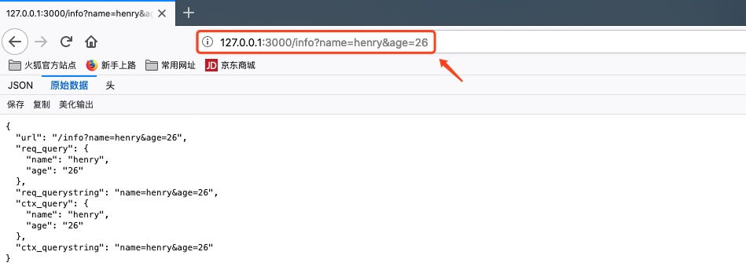

[官网地址 >>](https://www.koajs.com.cn/)

# 一、概述

koa 是由 Express 原班人马打造的，致力于成为一个更小、更富有表现力、更健壮的 Web 框架。使用 koa 编写 web 应用，通过组合不同的 generator，可以免除重复繁琐的回调函数嵌套，并极大地提升错误处理的效率。koa 不在内核方法中绑定任何中间件，它仅仅提供了一个轻量优雅的函数库，使得编写 Web 应用变得得心应手。

Koa 应用是一个包含一系列中间件 generator 函数的对象。 这些中间件函数基于 request 请求以一个类似于栈的结构组成并依次执行。

Koa 的核心设计思路是为中间件层提供高级语法糖封装，以增强其互用性和健壮性，并使得编写中间件变得相当有趣。

Koa 包含了像 content-negotiation（内容协商）、cache freshness（缓存刷新）、proxy support（代理支持）和 redirection（重定向）等常用任务方法。

# 二、下载使用

```shell
# NPM
$ npm install koa
# Yarn
$ yarn add koa
```

代码示例：

```js
const Koa = require('koa');
const app = new Koa();
// 对于任何请求，app将调用该异步函数处理请
app.use(async ctx => {
  ctx.body = 'Hello World';
});

app.listen(3000);
console.log("Server running at http://127.0.0.1:3000");
```

浏览器访问：“http://127.0.0.1:3000”，页面出现“Hello world!”。

` app.listen(...)` 实际上是以下代码的语法糖:

```js
const http = require('http');
const Koa = require('koa');
const app = new Koa();
http.createServer(app.callback()).listen(3000);
```

这意味着您可以同时支持 HTTPS 和 HTTPS，或者在多个端口监听同一个应用。

```js
const http = require('http');
const https = require('https');
const Koa = require('koa');
const app = new Koa();
http.createServer(app.callback()).listen(3000);
https.createServer(app.callback()).listen(3001);
```

# 三、上下文

Koa Context 将 node 的 `request` 和 `response` 对象封装在一个单独的对象里面。context 在每个 request 请求中被创建，在中间件中作为接收器(receiver)来引用，或者通过 `this` 标识符来引用：

```js
app.use(async ctx => {
  ctx; // is the Context
  ctx.request; // is a koa Request
  ctx.response; // is a koa Response
});
```

[Request API >>](https://www.koajs.com.cn/#request)

[Response API >>](https://www.koajs.com.cn/#response)

# 四、处理跨域

中间件 => <b style="color:red;text-decoration:underline;">koa2-cors</b> 

**>> 下载：**

```shell
# NPM
$ npm install koa2-cors
# YARN 
$ yarn add koa2-cors
```

**>> 使用：**

```js
const cors = require('koa2-cors');
app.use(cors());
```

# 五、处理路由

路由是由一个URI和一个特定的HTTP 方法（GET、POST 等）组成，涉及到应用如何响应客户端对某个网站节点的访问。通俗的讲 => <b style="color:gray;"><ins>路由就是根据不同的URL 地址，加载不同的页面实现不同的功能。</ins></b>  Koa 中，我们使用 <b style="color:red;text-decoration:underline;">koa-router</b> 实现路由配置。

## 1. 基础示例

```shell
# NPM
$ npm install koa-router
# YARN
$ yarn add koa-router
```
代码示例：
```js
const Koa = require('koa');
const router = require('koa-router')(); // 注意：引入的方式
const app = new Koa();

router.get('/', (ctx, next) => {
	ctx.body = "Hello koa!";
})

router.get('/info', (ctx, next) => {
	ctx.body = JSON.stringify({
		name: "木子李",
		job: "前端工程师",
		email: "lihy_online@163.com",
		origin: "四川成都"
	});
});
app.use(router.routes()); 
app.use(router.allowedMethods());
/* 作用： 这是官方文档的推荐用法,我们可以看到router.allowedMethods()用在了路由匹配
router.routes()之后,目的在于：根据ctx.status 设置 response 响应头
*/
app.listen(3000, () => {
	console.log('server running at http://localhost:3000');
});
```

## 2. GET

在koa2 中GET 传值通过request 接收，但是接收的方法有两种：`query` 和`querystring`。

- `query`：返回的是格式化好的参数对象。
- `querystring`：返回的是请求字符串。

代码示例：

```js
router.get('/info', (ctx, next) => {
	let url = ctx.url;
	// 从request 中获取GET 请求
	let request = ctx.request;
	let req_query = request.query;
	let req_querystring = request.querystring;
	// 从context 中直接获取
	let ctx_query = ctx.query;
	let ctx_querystring = ctx.querystring;
	ctx.body = {
		url,
		req_query,
		req_querystring,
		ctx_query,
		ctx_querystring
	}
});
```

效果显示：



动态路由：

```js
// 请求方式 => http://localhost/product/123
router.get('/product/:aid', async (ctx) => {
	console.log(ctx.params); // { aid: '123' } // 获取动态路由的数据
	ctx.body = '商品页面';
});
```

客户端代码：

```html
<!DOCTYPE html>
<html lang="zh-CN">
	<head>
		<meta charset="utf-8">
		<title></title>
	</head>
	<body>	
		
		<script>
			// 1. 创建请求对象
			let xhr = new XMLHttpRequest();
			// 2. 配置请求
			xhr.open("POST", "http://127.0.0.1:3000/login", true);
			xhr.setRequestHeader("Content-Type", "application/json");
			xhr.responseType = "json";
			// 3. 发送请求
			xhr.send(JSON.stringify({
			    username: "admin",
			    password: "123"
			}));
			// 4. 监听请求
			xhr.onload = function() {
			    if(xhr.readyState == 4 && xhr.status == 200) {
			        console.log(xhr.response);
			    }else {
			        console.log("err");
			    }
			}
		</script>
	</body>
</html>
```

## 3. POST

中间件 => <b style="color:red;text-decoration:underline;">koa-bodyparser</b> 

**>> 下载：**

```shell
# NPM
$ npm install koa-bodyparser
# YARN
$ yarn add koa-bodyparser
```

**>> 使用：**

```js
// 1. 引入
const bodyParser = require('koa-bodyparser');
// 2. 使用
app.use(bodyParser());
// 3. 读取
router.post('/login', async (ctx) => {
	console.log(ctx.request.body);
});
```

[路由模块化配置 >>](https://www.jianshu.com/p/0b52bbbc6ecc)

# 六、处理静态资源

中间件：<b style="color:red;text-decoration:underline;">koa-static</b> 

**>> 下载：**

```shell
# NPM
$ npm install koa-static
# YARN
$ yarn add koa-static
```

**>> 使用：**

```js
// 1. 引入
const path = require('path');
const static = require('koa-static');
// 2. 使用
app.use(static(
    path.join(__dirname, "./www")
));
// 3. 浏览器访问
// => http://localhost:3000/images/koa.jpeg
```

# 七、完整代码

```json
"dependencies": {
  "koa": "^2.11.0",
  "koa-bodyparser": "^4.2.1",
  "koa-router": "^7.4.0",
  "koa-static": "^5.0.0",
  "koa2-cors": "^2.0.6"
}
```

```js
const Koa = require('koa');
const cors = require('koa2-cors');
const bodyParser = require('koa-bodyparser');
const path = require('path');
const static = require('koa-static');
const router = require('koa-router')(); // 注意：引入的方式
const app = new Koa();

router.get('/', (ctx, next) => {
	ctx.body = "Hello koa!";
})
router.get('/info', (ctx, next) => {
	let {query, querystring} = ctx.requeset;
	ctx.body = {
		query,
		querystring
	}
	
});
router.post('/login', async (ctx) => {
	console.log(ctx.request.body);
	ctx.body = JSON.stringify({
		code: 200,
		message: "操作成功!"
	})
});


app.use(cors());
app.use(bodyParser());
app.use(router.routes());
app.use(static(
    path.join(__dirname, "./www")
))
app.use(router.allowedMethods());

app.listen(3000, () => {
	console.log('server running at http://localhost:3000');
});

```

[页面部署参考 >>](https://www.jianshu.com/p/e07db03088ad)

# 八、访问数据库


